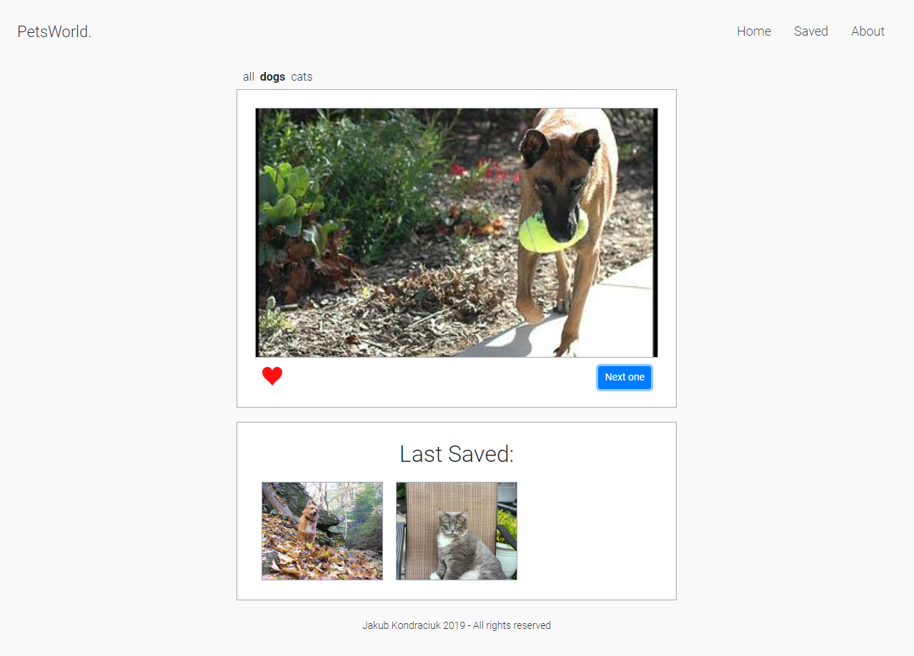
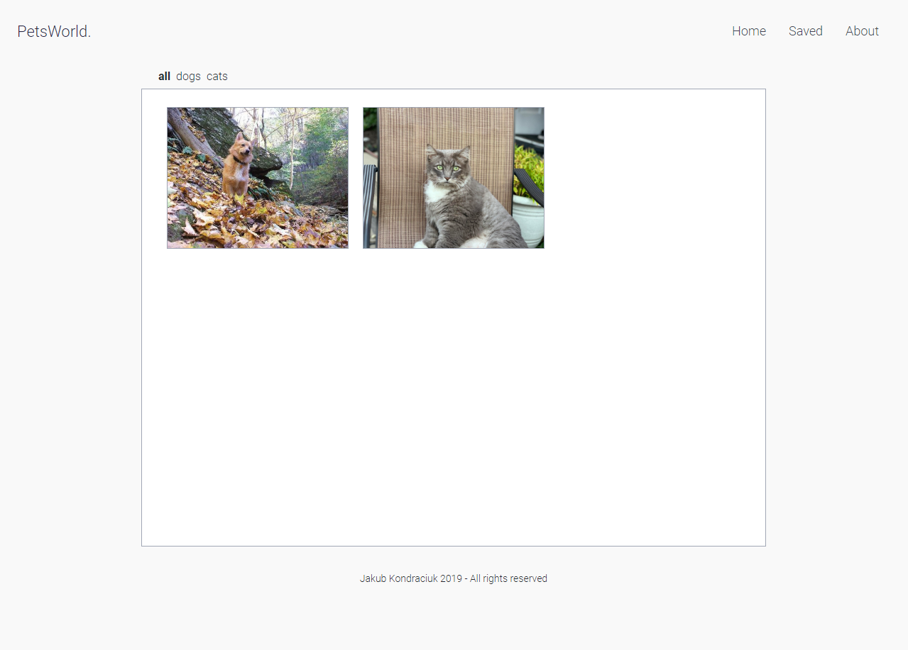
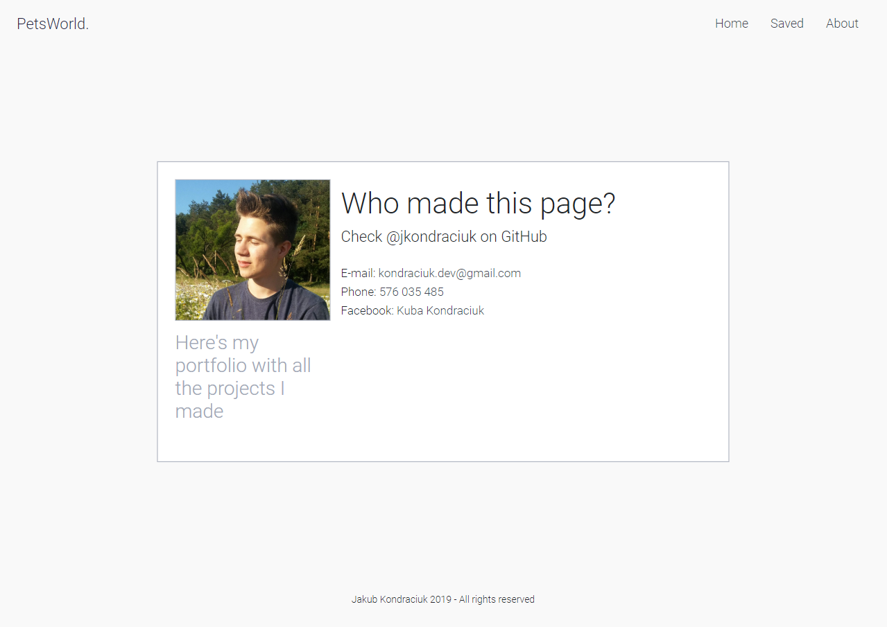

# PetsWorld
> A web application where you can look at some animals: dogs, cats and save your favorite ones

## Table of contents
* [General info](#general-info)
* [Screenshots](#screenshots)
* [Technologies](#technologies)
* [Setup](#setup)
* [Status](#status)
* [Inspiration](#inspiration)
* [Contact](#contact)

## General info
I made this project because I wanted to create a web application with Vue.js and Bootstrap that is nice in terms of design and code. The site is RWD

## Screenshots




## Technologies
* Vue.js - version 2.6.10
* Vue-router - version 3.0.3
* Vuex - version 3.1.1
* Bootstrap - version 4.3.1
* Babel - version 7.0.0
* Babel-jest - version 23.6.0
* ESLint - version 5.16.0
* Node-sass - version 4.9.0
* Axios - version 0.19.0

## Setup
* Setup of this project
```
npm install
```

* Compiles and hot-reloads for development
```
npm run serve
```

* Compiles and minifies for production
```
npm run build
```

* Run your tests
```
npm run test
```

* Lints and fixes files
```
npm run lint
```

* Run your unit tests
```
npm run test:unit
```

## Status
Project is: _in progress_

## Inspiration
The project was made entirely by myself, I wasn't inspired by any page or course

## Contact
Created by [@jKondraciuk](https://jkondraciuk.github.io/portfolio/) - feel free to contact me!
